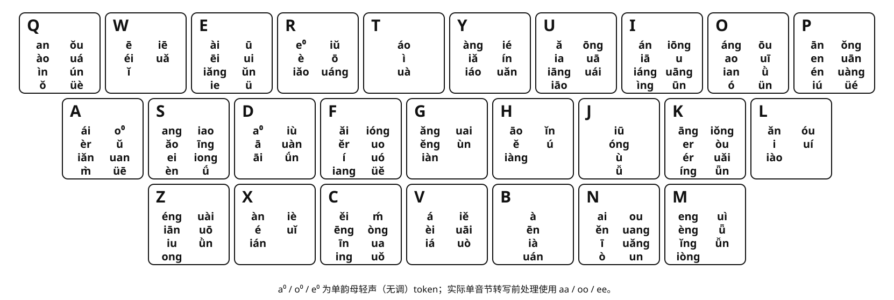

# 万象带调双拼：设计与复现说明

## 1. 设计目标

核心目标不是把带调韵母平均塞进 26 个键，而是**利用声调信息尽可能离散常用二字词，让高频二字词保持首选**。

对一个音节，编码可抽象为：

```text
固定声母键 + 带调韵母键
```

例如同一个韵母的不同声调会拆成不同 token：`an1`、`an2`、`an3`、`an4`。二字词由两个音节组成，只要两个竞争词在任意一个音节位置被带调韵母键分开，它们最终就不会落到同一个二字编码上。

因此，本方案把**二字词首选离散**放在所有键位均衡和手感目标之前。一个带调双拼方案如果不能明显减少常用二字词的首选冲突，那么声调信息就没有发挥最重要的作用。

## 2. 输入数据

核心复现词表为三列数据：

```text
词<TAB>带调拼音<TAB>权重
```

当前目标集包含 **27,398 个二字读音目标**，布局空间包含 **169 个带调韵母 token**。

权重有两个用途：

1. 决定同码词的首选顺序，并参与词频优先级优化。
2. 统计带调韵母和固定声母在真实输入中的使用质量，用于后续实体键负载与手感优化。

对外发布时，应把用于最终审计的那一版 27,398 条词表作为固定输入快照。只发布脚本而不固定词表，无法严格复现最终冲突数量。

## 3. 为什么优先优化二字词

二字词是中文连续输入中最常见、也最容易直接形成首选竞争的基本单位。长词通常还能依靠第三、第四个字继续离散，而二字词如果已经在完整输入处重码，就会直接影响候选顺序。

因此不把“韵母之间是否不同”本身当最终目标，而是直接看它们对二字词首选的影响。

假设两个二字词的固定声母键完全相同：

```text
词 A = 声母1 + token A1，声母2 + token A2
词 B = 声母1 + token B1，声母2 + token B2
```

只有当两个位置都没有被分开时，两个词才会得到相同编码。只要满足以下任意一个条件，就能完成离散：

```text
token A1 与 token B1 不同键
```

或：

```text
token A2 与 token B2 不同键
```

这也是整个优化模型最核心的逻辑。

## 4. 首选目标与优先级

### 4.1 Source-first

对于原始读音结构完全相同的一组词，同一编码不可能让所有词同时成为唯一首选。模型先按权重确定该读音组的 `source-first` 目标，再优化这些目标能否在最终布局中保持首选。

同一个目标即使被多个竞争词压住，也只计一次首选损失，避免重复惩罚同一词条。

### 4.2 高频优先

词频按照以下层级依次优化：

| 优先级 | 目标权重 | 优化顺序 |
| ---: | ---: | --- |
| 1 | `>= 100000` | 先最小化次选数量，再最小化损失权重 |
| 2 | `30000–99999` | 先最小化次选数量，再最小化损失权重 |
| 3 | `10000–29999` | 先最小化次选数量，再最小化损失权重 |
| 4 | `4000–9999` | 先最小化次选数量，再最小化损失权重 |
| 5 | `1000–3999` | 先最小化次选数量，再最小化损失权重 |

这里始终是 **COUNT 优先于 WEIGHT**。

COUNT 决定要牺牲多少个词；WEIGHT 只在损失数量已经固定后，尽量让被牺牲的词落在更低权重一侧。上一层得到的结果会被锁定，低频层不能通过牺牲更高频词来换取自己的改善。

### 4.3 最终发布审计

经过求解、词频合理性复核和后续权重调整后，当前最终剩余冲突为 **510 条**：

| 权重层 | 剩余冲突 |
| ---: | ---: |
| `>= 100000` | 0 |
| `30000–99999` | 0 |
| `10000–29999` | 0 |
| `4000–9999` | 5 |
| `1000–3999` | 505 |
| **合计** | **510** |

在同一套 27,398 个目标的发布审计口径下，高频三层保持为 0；当前 `4000+` 只剩 5 个目标需要继续权衡。
这 5 个目标分别是：`长焦`、`隔了`、`美满`、`议题`、`电竞`。

这里的 510 是**最终发布词表重新审计后的结果**，不是单纯把求解器输出中的数字人工改小。词频一旦调整，`source-first`、竞争关系和最终候选顺序都会重新计算，因此发布时必须同时保存最终词表快照。

## 5. 硬约束

### 5.1 一至四声分离

同一韵母的一、二、三、四声默认必须落在不同按键，这是带调离散的基础硬约束。

### 5.2 轻声策略

默认使用：

```text
neutral_policy = free
```

也就是轻声或无调的 `0` token 拥有独立变量，但允许与同韵母的一至四声共键。若改成 `distinct`，轻声也必须与其它声调分开。

### 5.3 每键 token 数量

`--max-per-key` 是搜索约束，不是方案理论本身。当前正式布局使用过 `8` 作为复现参数，但后续实验可以放宽；真正应该比较的是词首选质量、实体键负载和手感，而不是机械追求“每键不超过 8 个”。

## 6. 两阶段优化

### 6.1 第一阶段：词首选离散

第一阶段只关心 token 之间如何分桶，不先绑定真实 QWERTY 键位。这样可以减少 26 个物理键标签造成的大量对称搜索。

这一阶段依次完成：

1. 建立带调 token。
2. 建立同韵母一至四声的硬分离关系。
3. 根据二字词的真实竞争关系建立首选软约束。
4. 按词频层级执行 COUNT / WEIGHT 词典序优化。
5. 锁定已经得到的高优先级结果。

第一阶段回答的是：**哪些带调韵母应该分开，哪些可以共用一个桶。**

### 6.2 第二阶段：真实键盘联合细化

词首选结果锁定后，第二模型把 token 分桶和真实 QWERTY 键位一起重新优化。任何后续手感目标都不能以恶化已经锁定的词首选层为代价。

第二阶段按以下顺序处理：

1. 加权热区代价。
2. 最大实体键总负载。
3. 冷键上的高频 token 质量。
4. 左右手交替。
5. 同键双击。
6. 同指移动。
7. 同手同排的大跨度移动。
8. 总负载 L1 均衡。

换句话说，**词的离散质量是主目标，键盘手感是在主目标边界内寻找更好的布局。**

## 7. 权重如何叠加到键盘负载

不按“一个键装了几个 token”衡量负载，而按这些 token 在词表中实际出现的加权质量计算。

对每个词的每个音节，都把该词权重累加一次：

```text
token_mass[token] += word_weight
initial_mass[声母键] += word_weight
```

某个物理键的总负载为：

```text
total_load[key]
= initial_mass[key]
+ 分配到该 key 的全部 token_mass 之和
```

因此两个都放了 7 个 token 的键，实际负载可能完全不同：一个键可能装的是高频韵调，另一个键可能主要是低频韵调。

热区代价同样按使用质量计算：

```text
heat_cost
= Σ token_mass[token] × KEY_HEAT_COST[该 token 所在键]
```

这使模型能够把真正高频的带调韵母优先放到更容易触达的位置，同时避免某个实体键因为“固定声母负载 + 韵调负载”叠加后过热。

当前正式布局的最大实体键总负载为 `85,790,054`，总负载 CV 为 `0.3265`；左右手交替率约 `54.40%`，同键双击约 `0.97%`。

## 8. 为什么求解后仍需要人工复核

词库权重来自语料统计，不等于绝对语言真理。特别是在 `1000–3999` 区间，专名、领域词、句法片段和常见完整词很容易因为语料来源产生偏差。

因此求解完成后，剩余冲突继续按四类复核：

| 类型 | 处理原则 |
| --- | --- |
| `SWAP` | 两词同码，但当前权重明显违背实际使用习惯，优先修正权重 |
| `PASS` | 次选词通常会继续输入第三、第四个字，长词自然离散，不必为两字阶段搬键 |
| `LAYOUT` | 两边都是常见、完整、经常在二字处结束的词，才优先考虑重新离散 token |
| `REVIEW` | 受行业、地域或语料领域影响明显，保留人工判断 |

例如一个词绝大多数实际输入都会继续组成三字、四字固定搭配，那么它在二字阶段不是首选并不一定构成真实输入问题。相反，两边都是高频完整二字词时，重码才更值得占用布局自由度去解决。

这一步不是绕开模型，而是把“语料权重”和“真实输入行为”重新对齐。修正后必须再次跑完整审计，不能只删除报告中的行。

## 9. 复现方法

### 9.1 环境

需要 Python 3 和 OR-Tools CP-SAT：


   [:octicons-download-24: 万象双拼](../files/万象双拼.zip){ .html-button .html-button--primary style="margin-top: 10px;" }

```bash
python -m pip install "ortools>=9.10,<10"
```

### 9.2 建议发布文件

至少保留以下文件：

```text
V12_tone_layout_optimizer.py
jichu_v12_final.dict.yaml
tone_final_to_key.tsv
V12_tone_keyboard_layout.svg
V12_DESIGN.md
```

其中 `jichu_v12_final.dict.yaml` 必须是产生当前 **510 条最终冲突**的最终权重版本，而不是更早的中间词表。

### 9.3 重新求解

```bash
python V12_tone_layout_optimizer.py \
  --jichu jichu_v12_final.dict.yaml \
  --out V12_balanced_global \
  --max-per-key 8 \
  --neutral-policy free \
  --tie-policy allow \
  --priority-mode lexicographic \
  --tier-thresholds 100000,30000,10000,4000,1000,0 \
  --workers 8
```

`--max-per-key 8` 只是用于复现这一版历史求解条件；研究新布局时可以调整该值。

### 9.4 只检查输入矩阵

```bash
python V12_tone_layout_optimizer.py \
  --jichu jichu_v12_final.dict.yaml \
  --matrix-only \
  --out V12_matrix_check
```

对于同一份固定输入，应首先核对：

```text
目标数        27,398
token 数      169
tone edges    202
```

脚本还会输出冲突矩阵和输入摘要，可用于确认是否真的在使用同一份数据。

## 10. 如何理解“可复现”

这里有两个层面的复现：

**方法复现**：固定 Python、最终 27,398 条词表和参数后，可以重新构造完全相同的优化问题、优先级和审计逻辑。

**逐键结果复现**：当前求解包含限时、多线程 CP-SAT 阶段，部分阶段状态为 `FEASIBLE`，并不代表已经证明唯一全局最优。因此重新求解可能得到质量相同或接近、但逐键不同的布局。

如果需要精确复现当前发布键位，应把最终 `tone_final_to_key.tsv` 一并作为该版本的权威布局快照。

`FEASIBLE` 的含义只是“已经找到满足当前约束的可行解”；它不能被描述成“已经证明最优”。同理，`UNKNOWN` 也不能被解释为“该目标不可实现”。

## 11. 主要输出

| 文件 | 作用 |
| --- | --- |
| `tone_final_to_key.tsv` | 每个带调韵母 token 的最终按键、显示形式和使用质量 |
| `wanxiang_tone_layout.yaml` | 按键到 token 的完整布局 |
| `wanxiang_tone_algebra.clean.yaml` | 可部署的紧凑 Rime algebra |
| `source_first_global_audit.tsv` | 全部目标的最终首选审计 |
| `unresolved_review.tsv` | 剩余次选目标及实际压位词 |
| `bucket_load_summary.tsv` | 声母负载、韵调负载和实体键总负载 |
| `handfeel_summary.tsv` | 左右手、双击、同指、跨度和热区指标 |
| `v12_solver_summary.json` | 各优化阶段、证明状态和最终指标 |

## 12. 当前键位图

下面的图直接由最终 `tone_final_to_key.tsv` 生成，不手工抄写键位。`(0)` 表示轻声或无调 token；其它条目直接显示带声调符号的韵母。

其中aa oo ee分别表示其单韵母字的轻声用法，属于特殊用法。


